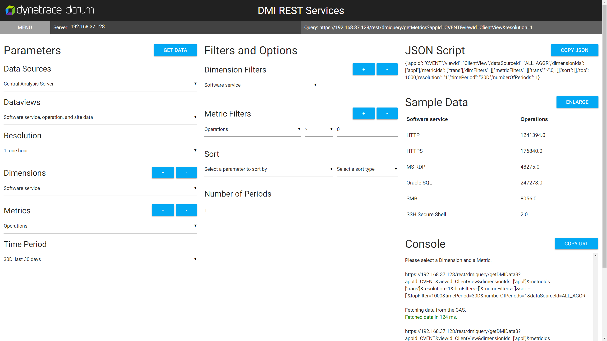

# <b style='color: red;'>STILL IN DEVELOPMENT</b>

# RESTfulDC
A RESTful helper for DC RUM.

To use this tool:

1) Copy the files of this repo into a folder called RESTfulDC in your CAS's `[install]/www_root/custom` folder

2) Navigate to your CAS `https://[hostname]/custom/RESTfulDC/index.html`

3) Log in [twice] and start pulling data!

#### Standard Version

Using the files in the root directory, this is what the RESTful Helper will look like.

